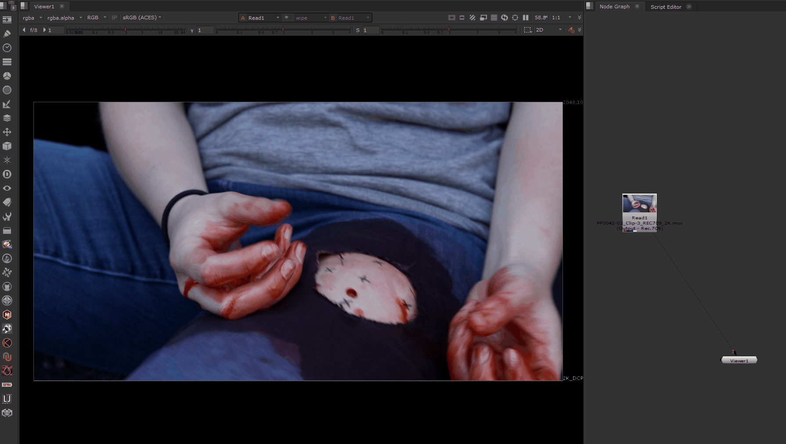

# Nuke Send to Mocha 

A Python script for Foundry Nuke (including Nuke Indie) that allows digital compositors to send a Read node directly to Boris FX Mocha Pro Standalone.
This tool is especially useful for Nuke Indie users who might face limitations with the integrated OFX plugin and prefer a seamless way to open footage in Mocha Pro with project settings (range, FPS, aspect ratio) pre-configured.
* Inspired by the old version of the "Send to Mocha" script by Imagineer Systems (Boris FX now).

Features:

One-Click Export: Launch Mocha Pro with the selected footage.
Auto-Sync: Automatically sets Frame Range, FPS, and Pixel Aspect Ratio.
Indie Friendly: Works within Nuke Indie's Python restrictions.
Cross-Platform: Designed to work on Windows, but you can try it on macOS, and Linux.
